# dLLM Benchmark Technical Data Report

Data snapshot generated 2026-07-28 from the locally imported RTX 4090 pilot outputs. This document contains measurement tables, task diagnostics, matched comparisons, and trace data only.

Tracked machine-readable snapshots: [primary/system metrics](data/pilot_summary.csv), [trace metrics](data/trace_metrics.csv), and [structure-first metrics](data/structure_first_metrics.csv).

## 1. Run Metadata

| Run | Checkpoint | Config | GPU | Precision | Torch | Code commit(s) |
|---|---|---|---|---|---|---|
| Qwen3-4B AR | Qwen/Qwen3-4B | ar-baseline | NVIDIA GeForce RTX 4090 | not recorded | 2.6.0+cu124 | 6dfd1321, 900f946b |
| iLLaDA Best | GSAI-ML/iLLaDA-8B-Instruct | best | NVIDIA GeForce RTX 4090 | BF16 | 2.6.0+cu124 | 3c7a6e08, 6dfd1321 |
| iLLaDA Fast | GSAI-ML/iLLaDA-8B-Instruct | fast | NVIDIA GeForce RTX 4090 | BF16 | 2.6.0+cu124 | 3c7a6e08, 6dfd1321 |
| DreamReasoner Best | Dream-org/DreamReasoner-8B | best | NVIDIA GeForce RTX 4090 | BF16 | 2.5.1+cu124 | 6dfd1321, 900f946b |
| DreamReasoner Fast | Dream-org/DreamReasoner-8B | fast | NVIDIA GeForce RTX 4090 | BF16 | 2.5.1+cu124 | 6dfd1321, 900f946b |

All current rows use one RTX 4090. Rows were produced by multiple code commits, as shown above; no confidence interval from repeated hardware runs is available. `compute_per_sample_tflops` and CPS are null in every imported row because deferred compute replay has not been run.

## 2. Coverage, Success, And OOM

| Run | GSM8K | MBPP | StructEval-T | Sudoku | RULER | HelloBench |
|---|---|---|---|---|---|---|
| Qwen3-4B AR | 100/100 | 100/100 | 100/100 | 100/100 | 60/60 | 20/20 |
| iLLaDA Best | 100/100 | 100/100 | 100/100 | 100/100 | 0/30; OOM 30 | 1/1 |
| iLLaDA Fast | 100/100 | 100/100 | 100/100 | 100/100 | 0/30; OOM 30 | - |
| DreamReasoner Best | 100/100 | 100/100 | 55/100; OOM 45 | 100/100 | - | - |
| DreamReasoner Fast | 100/100 | 100/100 | 55/100; OOM 45 | 100/100 | - | - |

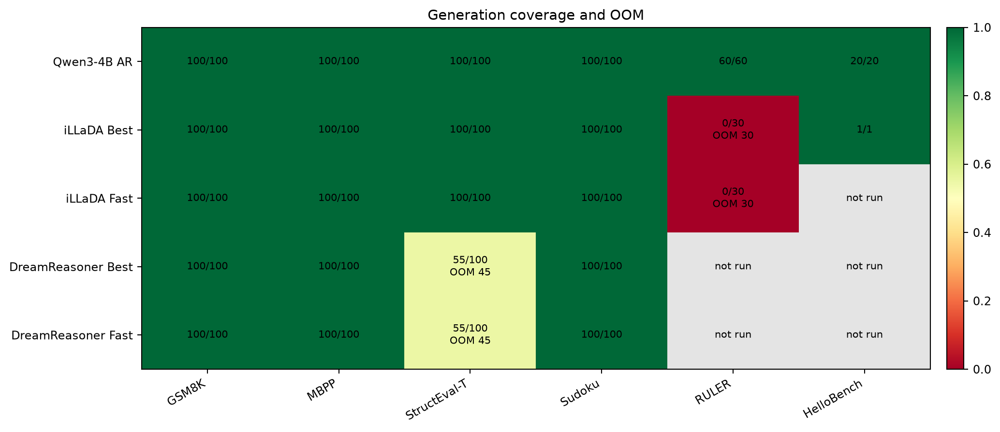

Figure 1. Successful generations over selected samples. DreamReasoner StructEval-T has 55 successes and 45 OOMs. iLLaDA RULER has 30 OOMs for both profiles. Blank cells were not run or not imported.

## 3. Complete Primary And Resource Measurements

| Run | Dataset | N | Success | q | TPS | s/sample | J/sample | Mean W | VRAM GiB | q/kJ | Valid | Complete | Timing |
|---|---|---|---|---|---|---|---|---|---|---|---|---|---|
| Qwen3-4B AR | GSM8K | 100 | 100 | 0.59 | 23.62 | 8.891 | 995.8 | 112 | 7.76 | 0.5925 | 98% | 35% | measured |
| iLLaDA Best | GSM8K | 100 | 100 | 0.15 | 21.39 | 11.968 | 3918.7 | 327.4 | 14.55 | 0.0383 | 79% | 39% | measured |
| iLLaDA Fast | GSM8K | 100 | 100 | 0.21 | 42.66 | 6.001 | 1939.8 | 323.3 | 14.55 | 0.1083 | 78% | 34% | measured |
| DreamReasoner Best | GSM8K | 100 | 100 | 0.51 | 61.21 | 4.183 | 698.5 | 167 | 20.25 | 0.7301 | 96% | 24% | measured |
| DreamReasoner Fast | GSM8K | 100 | 100 | 0.57 | 90.95 | 2.815 | 500.8 | 177.9 | 20.24 | 1.1382 | 97% | 15% | measured |
| Qwen3-4B AR | MBPP | 100 | 100 | 0.06 | 23.48 | 9.709 | 1085.7 | 111.8 | 7.74 | 0.0553 | 11% | 86% | measured |
| iLLaDA Best | MBPP | 100 | 100 | 0 | 21.45 | 11.935 | 3792.9 | 317.8 | 14.46 | 0 | 1% | 16% | measured |
| iLLaDA Fast | MBPP | 100 | 100 | 0 | 42.9 | 5.968 | 1889.7 | 316.6 | 14.46 | 0 | 0% | 7% | measured |
| DreamReasoner Best | MBPP | 100 | 100 | 0.01 | 41.46 | 6.174 | 1113.4 | 180.3 | 18.99 | 0.009 | 1% | 37% | measured |
| DreamReasoner Fast | MBPP | 100 | 100 | 0.02 | 67.61 | 3.786 | 666.1 | 175.9 | 18.97 | 0.03 | 2% | 31% | measured |
| Qwen3-4B AR | StructEval-T | 100 | 100 | 0.5803 | 23.55 | 9.125 | 1033.4 | 113.3 | 7.84 | 0.5616 | 67% | 34% | measured |
| iLLaDA Best | StructEval-T | 100 | 100 | 0.06 | 12.83 | 19.956 | 7733.7 | 387.5 | 15.05 | 0.0078 | 30% | 0% | measured |
| iLLaDA Fast | StructEval-T | 100 | 100 | 0.056 | 25.66 | 9.975 | 3933.4 | 394.3 | 15.05 | 0.0142 | 28% | 0% | measured |
| DreamReasoner Best | StructEval-T | 100 | 55 | 0.0193 | 89.16 | 2.871 | 503.5 | 175.4 | 22.75 | 0.0383 | 5% | 2% | measured |
| DreamReasoner Fast | StructEval-T | 100 | 55 | 0.0384 | 127.16 | 2.013 | 344.1 | 170.9 | 22.76 | 0.1116 | 4% | 5% | measured |
| Qwen3-4B AR | Sudoku | 100 | 100 | 0.008 | 23.4 | 10.94 | 1227.5 | 112.2 | 7.76 | 0.0065 | 97% | 0% | measured |
| iLLaDA Best | Sudoku | 100 | 100 | 0 | 17.1 | 14.973 | 5358.2 | 357.9 | 14.56 | 0 | 0% | 0% | measured |
| iLLaDA Fast | Sudoku | 100 | 100 | 0 | 34.2 | 7.486 | 2655.1 | 354.7 | 14.56 | 0 | 0% | 0% | measured |
| DreamReasoner Best | Sudoku | 100 | 100 | 0.000708 | 96.21 | 2.661 | 449.7 | 169 | 20.66 | 0.0016 | 8% | 0% | measured |
| DreamReasoner Fast | Sudoku | 100 | 100 | 0.000708 | 125.75 | 2.036 | 350.5 | 172.2 | 20.66 | 0.002 | 3% | 0% | measured |
| Qwen3-4B AR | RULER | 60 | 60 | 0.3 | 8.96 | 5.033 | 1809.9 | 359.6 | 16.22 | 0.1658 | 100% | 100% | measured |
| iLLaDA Best | RULER | 30 | 0 | 0 | - | - | - | - | - | - | 0% | 0% | unavailable |
| iLLaDA Fast | RULER | 30 | 0 | 0 | - | - | - | - | - | - | 0% | 0% | unavailable |
| Qwen3-4B AR | HelloBench | 20 | 20 | 0.4921 | 23.3 | 125.341 | 1.44e+04 | 115.2 | 11.23 | 0.0341 | 100% | 35% | measured |
| iLLaDA Best | HelloBench | 1 | 1 | 0.2432 | 2.29 | 1340.493 | 6.01e+05 | 448.6 | 17.04 | 0.000404 | 100% | 0% | measured |

`Mean W` is EPS (`J/s`). The legacy CSV field named `score_per_energy` is `q / EPS`, so it is not Score/J. The `q/kJ` column above is recomputed as `1000 * q / (J/sample)` and is the energy-per-sample efficiency value used in this report.

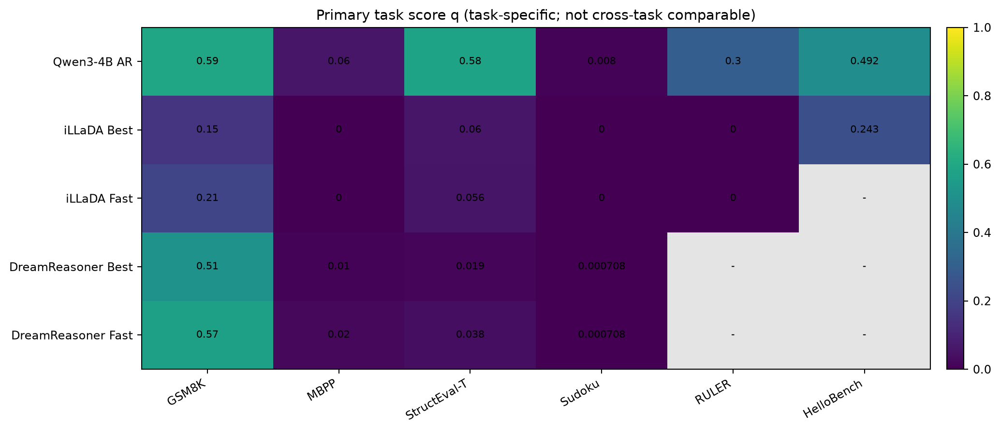

Figure 2. Task-specific primary score. Values are comparable across runs within one dataset only.

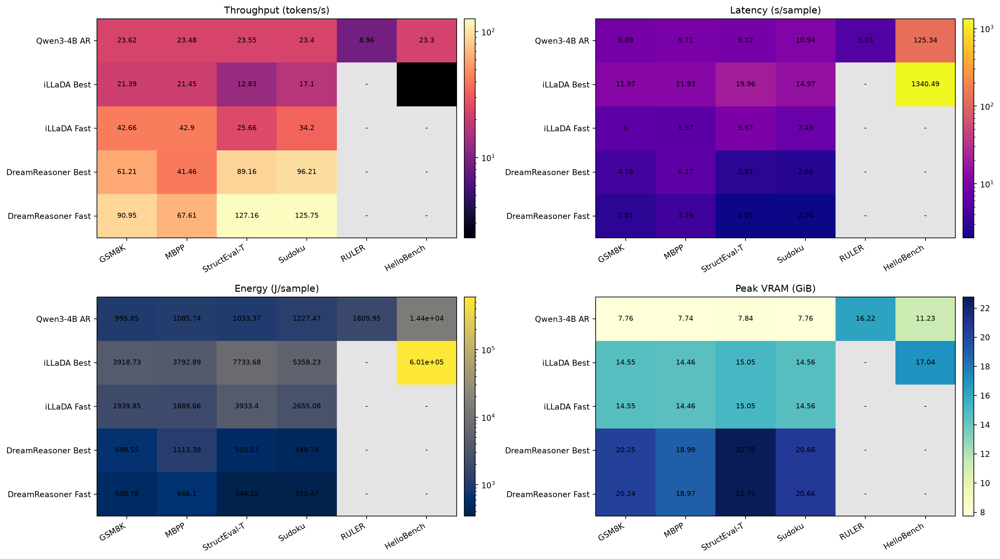

Figure 3. TPS, wall time, joules per sample, and peak VRAM. TPS, time, and energy use logarithmic color normalization. Missing/OOM-only cells are gray.

## 4. Quality-Cost Coordinates

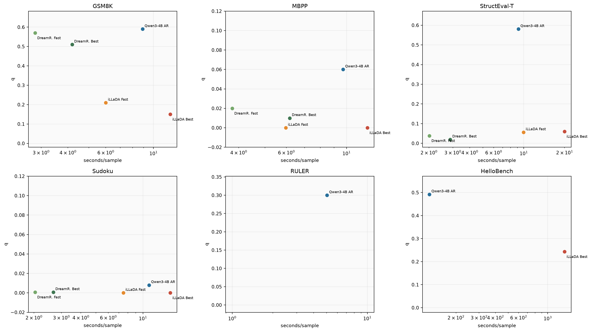

Figure 4. Primary score against measured seconds per sample; x axes are logarithmic. HelloBench includes Qwen n=20 and iLLaDA Best n=1 and is shown as coverage, not a matched estimate.

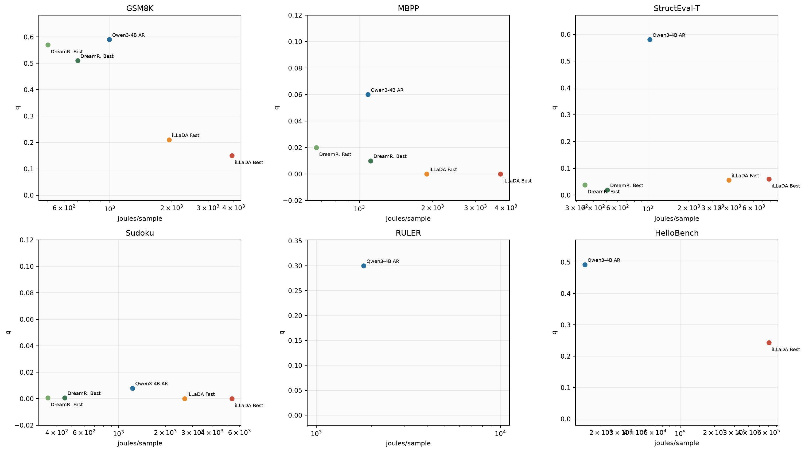

Figure 5. Primary score against measured joules per sample; x axes are logarithmic. OOM-only cells have no cost coordinate.

### 4.1 AR-Relative Ratios

| Dataset | dLLM run | q / AR q | latency / AR | energy / AR | VRAM / AR |
|---|---|---|---|---|---|
| GSM8K | iLLaDA Best | 0.254 | 1.346 | 3.935 | 1.877 |
| GSM8K | iLLaDA Fast | 0.356 | 0.675 | 1.948 | 1.877 |
| GSM8K | DreamReasoner Best | 0.864 | 0.47 | 0.701 | 2.611 |
| GSM8K | DreamReasoner Fast | 0.966 | 0.317 | 0.503 | 2.61 |
| MBPP | iLLaDA Best | 0 | 1.229 | 3.493 | 1.868 |
| MBPP | iLLaDA Fast | 0 | 0.615 | 1.74 | 1.868 |
| MBPP | DreamReasoner Best | 0.167 | 0.636 | 1.025 | 2.453 |
| MBPP | DreamReasoner Fast | 0.333 | 0.39 | 0.613 | 2.451 |
| StructEval-T | iLLaDA Best | 0.103 | 2.187 | 7.484 | 1.92 |
| StructEval-T | iLLaDA Fast | 0.097 | 1.093 | 3.806 | 1.92 |
| StructEval-T | DreamReasoner Best | 0.033 | 0.315 | 0.487 | 2.902 |
| StructEval-T | DreamReasoner Fast | 0.066 | 0.221 | 0.333 | 2.904 |
| Sudoku | iLLaDA Best | 0 | 1.369 | 4.365 | 1.877 |
| Sudoku | iLLaDA Fast | 0 | 0.684 | 2.163 | 1.877 |
| Sudoku | DreamReasoner Best | 0.088 | 0.243 | 0.366 | 2.663 |
| Sudoku | DreamReasoner Fast | 0.088 | 0.186 | 0.286 | 2.663 |

Ratios use Qwen3-4B as the denominator on the same task. `latency / AR`, `energy / AR`, and `VRAM / AR` are costs, so lower is better. This is a pilot reference, not an equal-parameter or equal-training-compute claim.

## 5. Matched Best/Fast Comparisons

| Family | Dataset | Best q | Fast q | Delta q | Latency speedup | Energy reduction | TPS ratio | VRAM delta GiB |
|---|---|---|---|---|---|---|---|---|
| iLLaDA | GSM8K | 0.15 | 0.21 | 0.06 | 1.994 | 2.02 | 1.994 | 0 |
| iLLaDA | MBPP | 0 | 0 | 0 | 2 | 2.007 | 2 | 0 |
| iLLaDA | StructEval-T | 0.06 | 0.056 | -0.004 | 2.001 | 1.966 | 2.001 | 0 |
| iLLaDA | Sudoku | 0 | 0 | 0 | 2 | 2.018 | 2 | 0 |
| iLLaDA | RULER | 0 | 0 | 0 | - | - | - | - |
| DreamReasoner | GSM8K | 0.51 | 0.57 | 0.06 | 1.486 | 1.395 | 1.486 | -0.007 |
| DreamReasoner | MBPP | 0.01 | 0.02 | 0.01 | 1.631 | 1.671 | 1.631 | -0.015 |
| DreamReasoner | StructEval-T | 0.0193 | 0.0384 | 0.0191 | 1.426 | 1.463 | 1.426 | 0.016 |
| DreamReasoner | Sudoku | 0.000708 | 0.000708 | 0 | 1.307 | 1.283 | 1.307 | 0.002 |

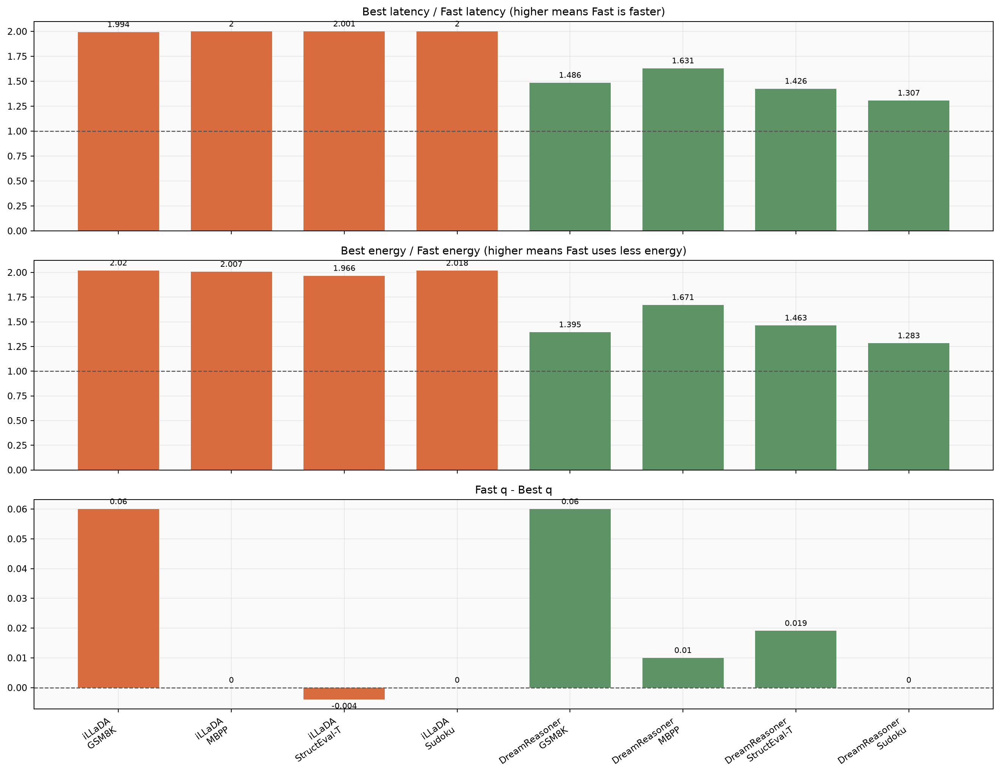

Figure 6. Matched profile deltas on rows with timing and energy. A latency or energy ratio above 1 favors Fast. `Delta q` is Fast minus Best. iLLaDA RULER is excluded from ratios because both rows are OOM-only.

## 6. Parse Validity And Completion

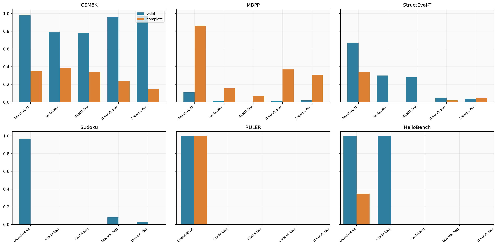

Figure 7. Parser validity and completion by task. These are independent of semantic correctness and expose outputs that never reached the requested answer format.

## 7. Task-Level Diagnostics

### 7.1 GSM8K

| Run | q | valid_rate | complete_rate |
|---|---|---|---|
| Qwen3-4B AR | 0.59 | 98.0% | 35.0% |
| iLLaDA Best | 0.15 | 79.0% | 39.0% |
| iLLaDA Fast | 0.21 | 78.0% | 34.0% |
| DreamReasoner Best | 0.51 | 96.0% | 24.0% |
| DreamReasoner Fast | 0.57 | 97.0% | 15.0% |

Observed rows: Qwen q=0.59; DreamReasoner Best/Fast q=0.51/0.57; iLLaDA Best/Fast q=0.15/0.21. DreamReasoner Fast is 1.49x faster and uses 1.39x less energy than DreamReasoner Best while increasing q by 0.06.

### 7.2 MBPP

| Run | q | pass_at_1 | valid_rate | complete_rate | executable_rate | structure_first_eligible_ratio | structure_first_score |
|---|---|---|---|---|---|---|---|
| Qwen3-4B AR | 0.06 | 0.06 | 11.0% | 86.0% | 11.0% | 99.0% | 0.0583 |
| iLLaDA Best | 0 | 0 | 1.0% | 16.0% | 1.0% | 55.0% | 0.2731 |
| iLLaDA Fast | 0 | 0 | 0.0% | 7.0% | 0.0% | 46.0% | 0.3244 |
| DreamReasoner Best | 0.01 | 0.01 | 1.0% | 37.0% | 1.0% | 0.0% | - |
| DreamReasoner Fast | 0.02 | 0.02 | 2.0% | 31.0% | 2.0% | 0.0% | - |

Observed rows: pass@1 is 0.06 for Qwen, 0/0 for iLLaDA Best/Fast, and 0.01/0.02 for DreamReasoner Best/Fast. Structure-first scores must be read together with their eligible ratios in Section 9.

### 7.3 StructEval-T

| Run | q | valid_rate | complete_rate | format_valid_rate | complete_correct_rate | official_render_score | official_key_validation_score | field_completion_rate | content_progress | structure_progress | structure_first_eligible_ratio | structure_first_score |
|---|---|---|---|---|---|---|---|---|---|---|---|---|
| Qwen3-4B AR | 0.5803 | 67.0% | 34.0% | 67.0% | 20.0% | 0.67 | 0.5577 | 55.8% | 0.6458 | 0.5383 | 61.0% | 0.4018 |
| iLLaDA Best | 0.06 | 30.0% | 0.0% | 30.0% | 0.0% | 0.3 | 0 | 0.0% | 0.5 | 0.3167 | 26.0% | 0.5 |
| iLLaDA Fast | 0.056 | 28.0% | 0.0% | 28.0% | 0.0% | 0.28 | 0 | 0.0% | 0.5 | 0.3233 | 26.0% | 0.5 |
| DreamReasoner Best | 0.0193 | 5.0% | 2.0% | - | - | - | - | - | - | - | 0.0% | - |
| DreamReasoner Fast | 0.0384 | 4.0% | 5.0% | - | - | - | - | - | - | - | 0.0% | - |

Observed rows: Qwen final score is 0.5803. iLLaDA Best/Fast are 0.0600/0.0560 with zero complete-correct outputs. DreamReasoner Best/Fast are 0.0193/0.0384 and each has 45 OOMs; their timing/resource means cover the 55 successful samples.

### 7.4 Sudoku

| Run | q | exact_solve_rate | valid_rate | complete_rate | blank_cell_accuracy | cell_accuracy | given_preservation_rate | completion_rate | constraint_satisfaction_rate | conflict_rate | blank_cell_accuracy_easy | blank_cell_accuracy_hard |
|---|---|---|---|---|---|---|---|---|---|---|---|---|
| Qwen3-4B AR | 0.008 | 0.0% | 97.0% | 0.0% | 0.008 | 0.2056 | 44.5% | 49.1% | 86.7% | 13.3% | 0.005 | 0.011 |
| iLLaDA Best | 0 | 0.0% | 0.0% | 0.0% | 0 | 0 | 0.0% | 0.0% | 0.0% | 100.0% | 0 | 0 |
| iLLaDA Fast | 0 | 0.0% | 0.0% | 0.0% | 0 | 0 | 0.0% | 0.0% | 0.0% | 100.0% | 0 | 0 |
| DreamReasoner Best | 0.000708 | 0.0% | 8.0% | 0.0% | 0.000708 | 0.0138 | 3.0% | 4.0% | 6.6% | 93.4% | 0.001 | 0.000417 |
| DreamReasoner Fast | 0.000708 | 0.0% | 3.0% | 0.0% | 0.000708 | 0.00037 | 0.0% | 1.6% | 2.3% | 97.7% | 0.001 | 0.000417 |

All exact-solve rates are zero. These rows come from the pre-repair prompt/parser snapshot: Qwen's nonzero blank-cell score (0.0080) and DreamReasoner's 0.0007 must remain audit data, not solving claims. iLLaDA never produced a parseable grid.

### 7.5 RULER

| Run | q | valid_rate | complete_rate | accuracy_context_8192 | accuracy_niah_context_8192 | accuracy_multi_hop_context_8192 | accuracy_aggregation_context_8192 | accuracy_front_context_8192 | accuracy_middle_context_8192 | accuracy_back_context_8192 | position_robustness_context_8192 | accuracy_context_40960 | context_retention |
|---|---|---|---|---|---|---|---|---|---|---|---|---|---|
| Qwen3-4B AR | 0.3 | 100.0% | 100.0% | 0.6 | 0.9 | 0.4 | 0.5 | 0.5 | 0.6 | 0.7 | 0.7143 | 0 | 0 |
| iLLaDA Best | 0 | 0.0% | 0.0% | 0 | 0 | 0 | 0 | 0 | 0 | 0 | 0 | - | - |
| iLLaDA Fast | 0 | 0.0% | 0.0% | 0 | 0 | 0 | 0 | 0 | 0 | 0 | 0 | - | - |

Qwen's imported run contains 60 rows across the historical 8,192 and 40,960 context points: accuracy is 0.60 at 8,192 and 0 at 40,960, producing q=0.30. The current formal protocol has since changed to the shared 8,192 point only. Both iLLaDA profiles are 30/30 OOM.

### 7.6 HelloBench

| Run | q | valid_rate | complete_rate | objective_quality_score | output_word_count | length_ratio | length_compliance_rate | seq_rep_4 | repeated_segment_fraction | major_issue_free_rate | high_repetition_issue_rate | repeated_segment_loop_issue_rate | objective_quality_2000_words | objective_quality_4000_words | mean_output_words_2000_words | mean_output_words_4000_words | sample_count_2000_words | sample_count_4000_words |
|---|---|---|---|---|---|---|---|---|---|---|---|---|---|---|---|---|---|---|
| Qwen3-4B AR | 0.4921 | 100.0% | 35.0% | 0.4921 | 2380.95 | 82.0% | 35.0% | 0.2838 | 0.1793 | 45.0% | 50.0% | 40.0% | 0.5404 | 0.4438 | 1798.5 | 2963.4 | 10 | 10 |
| iLLaDA Best | 0.2432 | 100.0% | 0.0% | 0.2432 | 2277 | 113.9% | 0.0% | 0.3052 | 0.3122 | 0.0% | 100.0% | 100.0% | 0.2432 | - | 2277 | - | 1 | - |

Coverage is unmatched: Qwen has 20 samples across 2K/4K targets; iLLaDA Best has one 2K sample. The iLLaDA row took 1,340.49 s and 601.41 kJ, generated 2,277 words, and triggered both high-repetition and repeated-segment-loop flags.

## 8. Trace Parallelism

| Run | Dataset | Trace N | Mean TPF | Peak TPF | Early | Middle | Late | tau32 | tau64 |
|---|---|---|---|---|---|---|---|---|---|
| Qwen3-4B AR | GSM8K | 100 | 1 | 1 | 33.3% | 33.2% | 33.5% | 1 | 1 |
| iLLaDA Best | GSM8K | 100 | 1 | 1 | 33.2% | 33.2% | 33.6% | 0.878 | 0.94 |
| iLLaDA Fast | GSM8K | 100 | 2 | 2 | 33.6% | 32.8% | 33.6% | 0.867 | 0.935 |
| DreamReasoner Best | GSM8K | 100 | 2.354 | 22 | 30.5% | 26.7% | 42.8% | 0.799 | 0.891 |
| DreamReasoner Fast | GSM8K | 100 | 3.442 | 22.56 | 30.1% | 27.6% | 42.3% | 0.795 | 0.891 |
| Qwen3-4B AR | MBPP | 100 | 1 | 1 | 33.2% | 33.2% | 33.6% | 1 | 1 |
| iLLaDA Best | MBPP | 100 | 1 | 1 | 33.2% | 33.2% | 33.6% | 0.894 | 0.948 |
| iLLaDA Fast | MBPP | 100 | 2 | 2 | 33.6% | 32.8% | 33.6% | 0.896 | 0.949 |
| DreamReasoner Best | MBPP | 100 | 1.391 | 11.89 | 31.8% | 32.8% | 35.4% | 0.886 | 0.94 |
| DreamReasoner Fast | MBPP | 100 | 2.272 | 10.39 | 32.7% | 33.7% | 33.6% | 0.886 | 0.939 |
| Qwen3-4B AR | StructEval-T | 100 | 1 | 1 | 33.3% | 33.2% | 33.5% | 1 | 1 |
| iLLaDA Best | StructEval-T | 100 | 1 | 1 | 33.2% | 33.2% | 33.6% | 0.886 | 0.944 |
| iLLaDA Fast | StructEval-T | 100 | 2 | 2 | 33.6% | 32.8% | 33.6% | 0.87 | 0.936 |
| DreamReasoner Best | StructEval-T | 55 | 3.78 | 30.327 | 27.1% | 32.2% | 40.7% | 0.707 | 0.847 |
| DreamReasoner Fast | StructEval-T | 55 | 5.398 | 30.418 | 23.0% | 41.1% | 35.9% | 0.693 | 0.84 |
| Qwen3-4B AR | Sudoku | 100 | 1 | 1 | 33.2% | 33.2% | 33.6% | 1 | 1 |
| iLLaDA Best | Sudoku | 100 | 1 | 1 | 33.2% | 33.2% | 33.6% | 0.884 | 0.943 |
| iLLaDA Fast | Sudoku | 100 | 2 | 2 | 33.6% | 32.8% | 33.6% | 0.89 | 0.946 |
| DreamReasoner Best | Sudoku | 100 | 3.592 | 27.56 | 21.1% | 37.5% | 41.4% | 0.719 | 0.858 |
| DreamReasoner Fast | Sudoku | 100 | 4.822 | 26.19 | 20.1% | 39.6% | 40.3% | 0.702 | 0.839 |
| Qwen3-4B AR | RULER | 60 | 1 | 1 | 34.2% | 30.5% | 35.3% | 1 | 1 |
| iLLaDA Best | RULER | 0 | - | - | - | - | - | - | - |
| iLLaDA Fast | RULER | 0 | - | - | - | - | - | - | - |

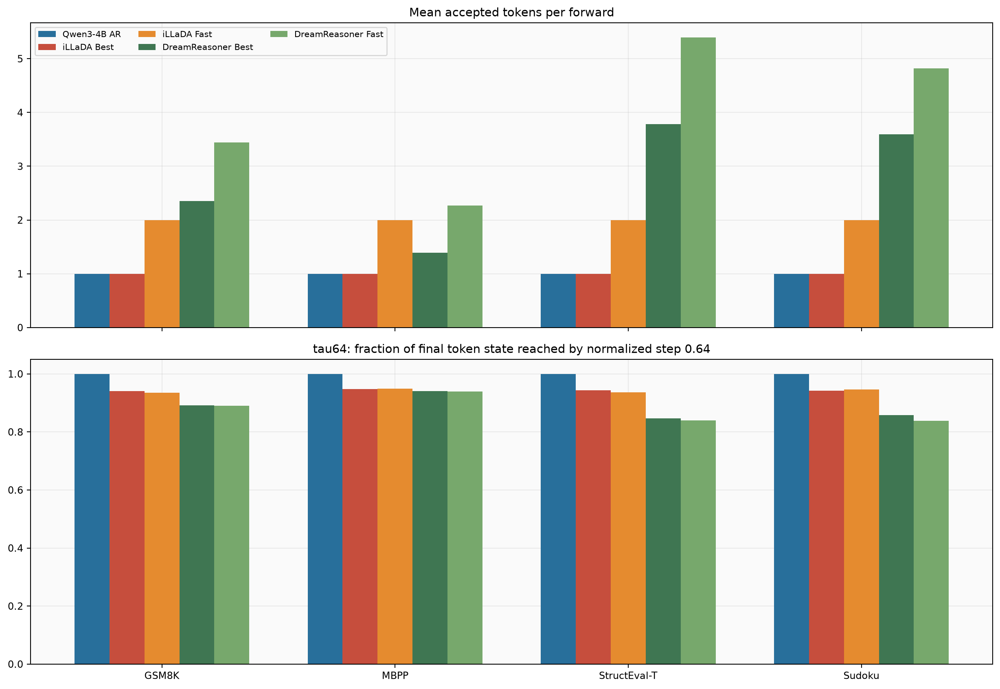

Figure 8. Mean accepted tokens per forward and tau64. iLLaDA Best/Fast are exactly 1/2 TPF because the configured schedule commits one/two tokens per denoising forward; these bars describe the sampler budget, not emergent parallelism.

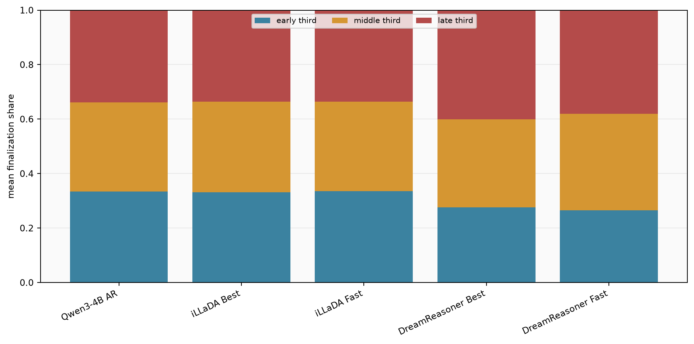

Figure 9. Mean fraction of final token states first reached in the early, middle, and late thirds of generation, averaged across trace-bearing task rows.

## 9. Structure-First Trace Diagnostics

| Run | Dataset | Selected | Trace N | Eligible N | Eligible ratio | Structure-first | 95% CI |
|---|---|---|---|---|---|---|---|
| Qwen3-4B AR | MBPP | 100 | 100 | 99 | 99.0% | 0.058 | [0.035, 0.085] |
| iLLaDA Best | MBPP | 100 | 100 | 55 | 55.0% | 0.273 | [0.22, 0.325] |
| iLLaDA Fast | MBPP | 100 | 100 | 46 | 46.0% | 0.324 | [0.27, 0.375] |
| DreamReasoner Best | MBPP | 100 | 100 | 99 | 99.0% | 0.454 | [0.421, 0.488] |
| DreamReasoner Fast | MBPP | 100 | 100 | 100 | 100.0% | 0.437 | [0.408, 0.466] |
| Qwen3-4B AR | StructEval-T | 100 | 100 | 61 | 61.0% | 0.402 | [0.374, 0.429] |
| iLLaDA Best | StructEval-T | 100 | 100 | 26 | 26.0% | 0.5 | [0.5, 0.5] |
| iLLaDA Fast | StructEval-T | 100 | 100 | 26 | 26.0% | 0.5 | [0.5, 0.5] |
| DreamReasoner Best | StructEval-T | 100 | 55 | 4 | 4.0% | 0.327 | [0.27, 0.394] |
| DreamReasoner Fast | StructEval-T | 100 | 55 | 5 | 5.0% | 0.415 | [0.331, 0.474] |

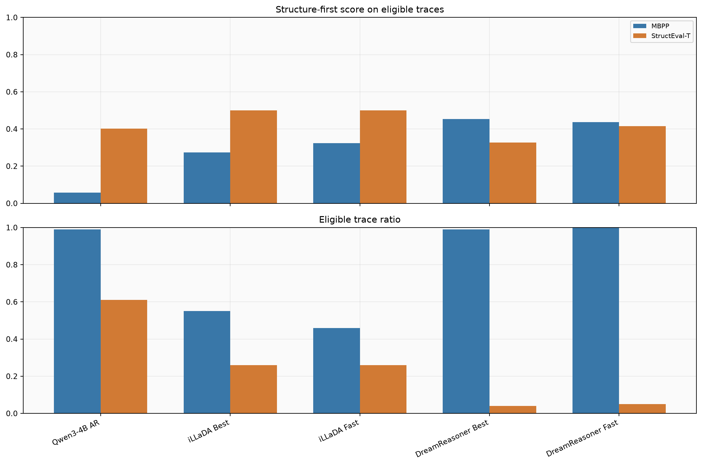

Figure 10. Structure-first score is conditional on eligible traces. The lower panel is required for interpretation: for StructEval-T the eligible ratio is 61% for Qwen, 26% for either iLLaDA profile, and 4-5% for DreamReasoner.

## 10. Representative StructEval-T Trace Heatmaps

| Qwen3-4B AR | iLLaDA Best | DreamReasoner Best |
|---|---|---|
| 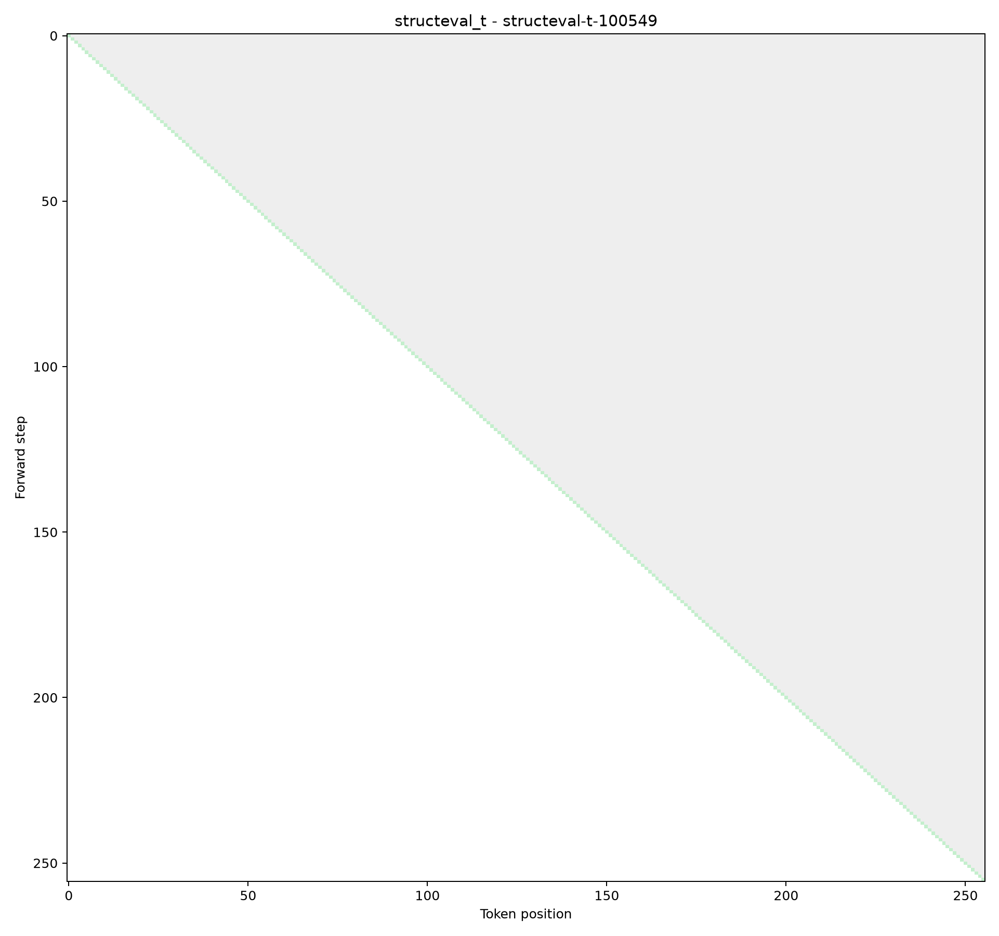 | 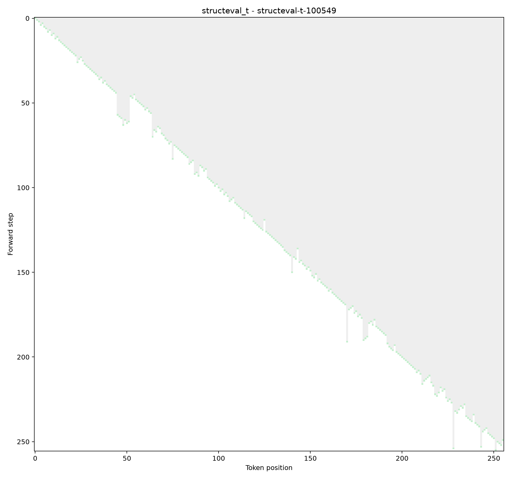 | 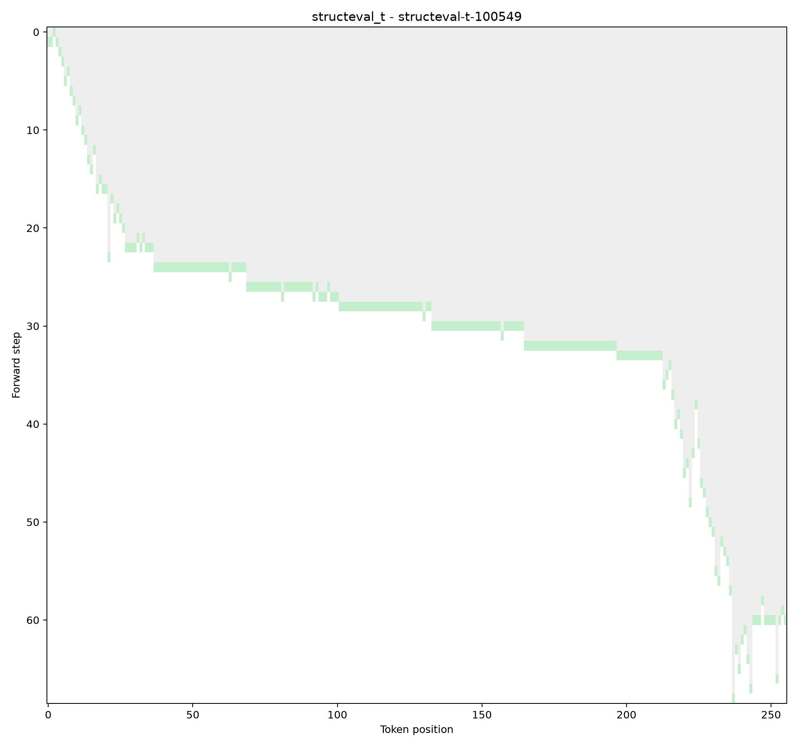 |

Figure 11. Forward step versus token position for shared sample `structeval-t-100549`. These plots expose stabilization/revision patterns only; final task scores and parser validity remain separate measurements.

## 11. Missing Measurement Cells

| Missing cell | State in this snapshot |
|---|---|
| DiffusionGemma vs Gemma 4 26B-A4B | No A100 generation/score/resource rows imported |
| Qwen3-8B | Adapter/config present; no result rows imported |
| W1 API | Adapter/config present; no validated result rows imported |
| Compute/CPS/TFLOPs | No deferred compute replay in any imported row |
| DreamReasoner RULER/HelloBench | No scored rows imported |
| iLLaDA Fast HelloBench | No scored row imported |
| Repeated-run uncertainty | No repeated same-hardware trials |

## 12. Complete Auxiliary-Metric Ledger

| Run | Dataset | Auxiliary metric | Value |
|---|---|---|---|
| Qwen3-4B AR | GSM8K | complete_rate | 0.35 |
| Qwen3-4B AR | GSM8K | valid_rate | 0.98 |
| iLLaDA Best | GSM8K | complete_rate | 0.39 |
| iLLaDA Best | GSM8K | valid_rate | 0.79 |
| iLLaDA Fast | GSM8K | complete_rate | 0.34 |
| iLLaDA Fast | GSM8K | valid_rate | 0.78 |
| DreamReasoner Best | GSM8K | complete_rate | 0.24 |
| DreamReasoner Best | GSM8K | valid_rate | 0.96 |
| DreamReasoner Fast | GSM8K | complete_rate | 0.15 |
| DreamReasoner Fast | GSM8K | valid_rate | 0.97 |
| Qwen3-4B AR | MBPP | complete_rate | 0.86 |
| Qwen3-4B AR | MBPP | executable_rate | 0.11 |
| Qwen3-4B AR | MBPP | pass_at_1 | 0.06 |
| Qwen3-4B AR | MBPP | structure_first_eligible_rate | 0.99 |
| Qwen3-4B AR | MBPP | structure_first_eligible_ratio | 0.99 |
| Qwen3-4B AR | MBPP | structure_first_score | 0.058325 |
| Qwen3-4B AR | MBPP | valid_rate | 0.11 |
| iLLaDA Best | MBPP | complete_rate | 0.16 |
| iLLaDA Best | MBPP | executable_rate | 0.01 |
| iLLaDA Best | MBPP | pass_at_1 | 0 |
| iLLaDA Best | MBPP | structure_first_eligible_rate | 0.55 |
| iLLaDA Best | MBPP | structure_first_eligible_ratio | 0.55 |
| iLLaDA Best | MBPP | structure_first_score | 0.273109 |
| iLLaDA Best | MBPP | valid_rate | 0.01 |
| iLLaDA Fast | MBPP | complete_rate | 0.07 |
| iLLaDA Fast | MBPP | executable_rate | 0 |
| iLLaDA Fast | MBPP | pass_at_1 | 0 |
| iLLaDA Fast | MBPP | structure_first_eligible_rate | 0.46 |
| iLLaDA Fast | MBPP | structure_first_eligible_ratio | 0.46 |
| iLLaDA Fast | MBPP | structure_first_score | 0.324358 |
| iLLaDA Fast | MBPP | valid_rate | 0 |
| DreamReasoner Best | MBPP | complete_rate | 0.37 |
| DreamReasoner Best | MBPP | executable_rate | 0.01 |
| DreamReasoner Best | MBPP | pass_at_1 | 0.01 |
| DreamReasoner Best | MBPP | structure_first_eligible_rate | 0 |
| DreamReasoner Best | MBPP | structure_first_eligible_ratio | 0 |
| DreamReasoner Best | MBPP | valid_rate | 0.01 |
| DreamReasoner Fast | MBPP | complete_rate | 0.31 |
| DreamReasoner Fast | MBPP | executable_rate | 0.02 |
| DreamReasoner Fast | MBPP | pass_at_1 | 0.02 |
| DreamReasoner Fast | MBPP | structure_first_eligible_rate | 0 |
| DreamReasoner Fast | MBPP | structure_first_eligible_ratio | 0 |
| DreamReasoner Fast | MBPP | valid_rate | 0.02 |
| Qwen3-4B AR | StructEval-T | complete_correct_rate | 0.2 |
| Qwen3-4B AR | StructEval-T | complete_rate | 0.34 |
| Qwen3-4B AR | StructEval-T | content_progress | 0.645804 |
| Qwen3-4B AR | StructEval-T | field_completion_rate | 0.557722 |
| Qwen3-4B AR | StructEval-T | final_eval_score | 0.5803 |
| Qwen3-4B AR | StructEval-T | format_valid_rate | 0.67 |
| Qwen3-4B AR | StructEval-T | official_key_validation_score | 0.557722 |
| Qwen3-4B AR | StructEval-T | official_render_score | 0.67 |
| Qwen3-4B AR | StructEval-T | structure_first_eligible_rate | 0.61 |
| Qwen3-4B AR | StructEval-T | structure_first_eligible_ratio | 0.61 |
| Qwen3-4B AR | StructEval-T | structure_first_score | 0.401791 |
| Qwen3-4B AR | StructEval-T | structure_progress | 0.53833 |
| Qwen3-4B AR | StructEval-T | valid_rate | 0.67 |
| iLLaDA Best | StructEval-T | complete_correct_rate | 0 |
| iLLaDA Best | StructEval-T | complete_rate | 0 |
| iLLaDA Best | StructEval-T | content_progress | 0.5 |
| iLLaDA Best | StructEval-T | field_completion_rate | 0 |
| iLLaDA Best | StructEval-T | final_eval_score | 0.06 |
| iLLaDA Best | StructEval-T | format_valid_rate | 0.3 |
| iLLaDA Best | StructEval-T | official_key_validation_score | 0 |
| iLLaDA Best | StructEval-T | official_render_score | 0.3 |
| iLLaDA Best | StructEval-T | structure_first_eligible_rate | 0.26 |
| iLLaDA Best | StructEval-T | structure_first_eligible_ratio | 0.26 |
| iLLaDA Best | StructEval-T | structure_first_score | 0.5 |
| iLLaDA Best | StructEval-T | structure_progress | 0.316667 |
| iLLaDA Best | StructEval-T | valid_rate | 0.3 |
| iLLaDA Fast | StructEval-T | complete_correct_rate | 0 |
| iLLaDA Fast | StructEval-T | complete_rate | 0 |
| iLLaDA Fast | StructEval-T | content_progress | 0.5 |
| iLLaDA Fast | StructEval-T | field_completion_rate | 0 |
| iLLaDA Fast | StructEval-T | final_eval_score | 0.056 |
| iLLaDA Fast | StructEval-T | format_valid_rate | 0.28 |
| iLLaDA Fast | StructEval-T | official_key_validation_score | 0 |
| iLLaDA Fast | StructEval-T | official_render_score | 0.28 |
| iLLaDA Fast | StructEval-T | structure_first_eligible_rate | 0.26 |
| iLLaDA Fast | StructEval-T | structure_first_eligible_ratio | 0.26 |
| iLLaDA Fast | StructEval-T | structure_first_score | 0.5 |
| iLLaDA Fast | StructEval-T | structure_progress | 0.323333 |
| iLLaDA Fast | StructEval-T | valid_rate | 0.28 |
| DreamReasoner Best | StructEval-T | complete_rate | 0.02 |
| DreamReasoner Best | StructEval-T | final_eval_score | 0.0193 |
| DreamReasoner Best | StructEval-T | structure_first_eligible_ratio | 0 |
| DreamReasoner Best | StructEval-T | valid_rate | 0.05 |
| DreamReasoner Fast | StructEval-T | complete_rate | 0.05 |
| DreamReasoner Fast | StructEval-T | final_eval_score | 0.0384 |
| DreamReasoner Fast | StructEval-T | structure_first_eligible_ratio | 0 |
| DreamReasoner Fast | StructEval-T | valid_rate | 0.04 |
| Qwen3-4B AR | Sudoku | accuracy_easy | 0 |
| Qwen3-4B AR | Sudoku | accuracy_hard | 0 |
| Qwen3-4B AR | Sudoku | blank_cell_accuracy | 0.008017 |
| Qwen3-4B AR | Sudoku | blank_cell_accuracy_easy | 0.005 |
| Qwen3-4B AR | Sudoku | blank_cell_accuracy_hard | 0.011034 |
| Qwen3-4B AR | Sudoku | cell_accuracy | 0.205556 |
| Qwen3-4B AR | Sudoku | complete_rate | 0 |
| Qwen3-4B AR | Sudoku | completion_rate | 0.491358 |
| Qwen3-4B AR | Sudoku | conflict_rate | 0.132963 |
| Qwen3-4B AR | Sudoku | constraint_satisfaction_rate | 0.867037 |
| Qwen3-4B AR | Sudoku | exact_solve_rate | 0 |
| Qwen3-4B AR | Sudoku | exact_solve_rate_easy | 0 |
| Qwen3-4B AR | Sudoku | exact_solve_rate_hard | 0 |
| Qwen3-4B AR | Sudoku | given_preservation_rate | 0.445314 |
| Qwen3-4B AR | Sudoku | n_easy | 50 |
| Qwen3-4B AR | Sudoku | n_hard | 50 |
| Qwen3-4B AR | Sudoku | valid_rate | 0.97 |
| iLLaDA Best | Sudoku | accuracy_easy | 0 |
| iLLaDA Best | Sudoku | accuracy_hard | 0 |
| iLLaDA Best | Sudoku | blank_cell_accuracy | 0 |
| iLLaDA Best | Sudoku | blank_cell_accuracy_easy | 0 |
| iLLaDA Best | Sudoku | blank_cell_accuracy_hard | 0 |
| iLLaDA Best | Sudoku | cell_accuracy | 0 |
| iLLaDA Best | Sudoku | complete_rate | 0 |
| iLLaDA Best | Sudoku | completion_rate | 0 |
| iLLaDA Best | Sudoku | conflict_rate | 1 |
| iLLaDA Best | Sudoku | constraint_satisfaction_rate | 0 |
| iLLaDA Best | Sudoku | exact_solve_rate | 0 |
| iLLaDA Best | Sudoku | exact_solve_rate_easy | 0 |
| iLLaDA Best | Sudoku | exact_solve_rate_hard | 0 |
| iLLaDA Best | Sudoku | given_preservation_rate | 0 |
| iLLaDA Best | Sudoku | n_easy | 50 |
| iLLaDA Best | Sudoku | n_hard | 50 |
| iLLaDA Best | Sudoku | valid_rate | 0 |
| iLLaDA Fast | Sudoku | accuracy_easy | 0 |
| iLLaDA Fast | Sudoku | accuracy_hard | 0 |
| iLLaDA Fast | Sudoku | blank_cell_accuracy | 0 |
| iLLaDA Fast | Sudoku | blank_cell_accuracy_easy | 0 |
| iLLaDA Fast | Sudoku | blank_cell_accuracy_hard | 0 |
| iLLaDA Fast | Sudoku | cell_accuracy | 0 |
| iLLaDA Fast | Sudoku | complete_rate | 0 |
| iLLaDA Fast | Sudoku | completion_rate | 0 |
| iLLaDA Fast | Sudoku | conflict_rate | 1 |
| iLLaDA Fast | Sudoku | constraint_satisfaction_rate | 0 |
| iLLaDA Fast | Sudoku | exact_solve_rate | 0 |
| iLLaDA Fast | Sudoku | exact_solve_rate_easy | 0 |
| iLLaDA Fast | Sudoku | exact_solve_rate_hard | 0 |
| iLLaDA Fast | Sudoku | given_preservation_rate | 0 |
| iLLaDA Fast | Sudoku | n_easy | 50 |
| iLLaDA Fast | Sudoku | n_hard | 50 |
| iLLaDA Fast | Sudoku | valid_rate | 0 |
| DreamReasoner Best | Sudoku | accuracy_easy | 0 |
| DreamReasoner Best | Sudoku | accuracy_hard | 0 |
| DreamReasoner Best | Sudoku | blank_cell_accuracy | 0.000708 |
| DreamReasoner Best | Sudoku | blank_cell_accuracy_easy | 0.001 |
| DreamReasoner Best | Sudoku | blank_cell_accuracy_hard | 0.000417 |
| DreamReasoner Best | Sudoku | cell_accuracy | 0.013827 |
| DreamReasoner Best | Sudoku | complete_rate | 0 |
| DreamReasoner Best | Sudoku | completion_rate | 0.040247 |
| DreamReasoner Best | Sudoku | conflict_rate | 0.933704 |
| DreamReasoner Best | Sudoku | constraint_satisfaction_rate | 0.066296 |
| DreamReasoner Best | Sudoku | exact_solve_rate | 0 |
| DreamReasoner Best | Sudoku | exact_solve_rate_easy | 0 |
| DreamReasoner Best | Sudoku | exact_solve_rate_hard | 0 |
| DreamReasoner Best | Sudoku | given_preservation_rate | 0.029874 |
| DreamReasoner Best | Sudoku | n_easy | 50 |
| DreamReasoner Best | Sudoku | n_hard | 50 |
| DreamReasoner Best | Sudoku | valid_rate | 0.08 |
| DreamReasoner Fast | Sudoku | accuracy_easy | 0 |
| DreamReasoner Fast | Sudoku | accuracy_hard | 0 |
| DreamReasoner Fast | Sudoku | blank_cell_accuracy | 0.000708 |
| DreamReasoner Fast | Sudoku | blank_cell_accuracy_easy | 0.001 |
| DreamReasoner Fast | Sudoku | blank_cell_accuracy_hard | 0.000417 |
| DreamReasoner Fast | Sudoku | cell_accuracy | 0.00037 |
| DreamReasoner Fast | Sudoku | complete_rate | 0 |
| DreamReasoner Fast | Sudoku | completion_rate | 0.015679 |
| DreamReasoner Fast | Sudoku | conflict_rate | 0.976667 |
| DreamReasoner Fast | Sudoku | constraint_satisfaction_rate | 0.023333 |
| DreamReasoner Fast | Sudoku | exact_solve_rate | 0 |
| DreamReasoner Fast | Sudoku | exact_solve_rate_easy | 0 |
| DreamReasoner Fast | Sudoku | exact_solve_rate_hard | 0 |
| DreamReasoner Fast | Sudoku | given_preservation_rate | 0 |
| DreamReasoner Fast | Sudoku | n_easy | 50 |
| DreamReasoner Fast | Sudoku | n_hard | 50 |
| DreamReasoner Fast | Sudoku | valid_rate | 0.03 |
| Qwen3-4B AR | RULER | accuracy_aggregation_context_40960 | 0 |
| Qwen3-4B AR | RULER | accuracy_aggregation_context_8192 | 0.5 |
| Qwen3-4B AR | RULER | accuracy_back_context_40960 | 0 |
| Qwen3-4B AR | RULER | accuracy_back_context_8192 | 0.7 |
| Qwen3-4B AR | RULER | accuracy_context_40960 | 0 |
| Qwen3-4B AR | RULER | accuracy_context_8192 | 0.6 |
| Qwen3-4B AR | RULER | accuracy_front_context_40960 | 0 |
| Qwen3-4B AR | RULER | accuracy_front_context_8192 | 0.5 |
| Qwen3-4B AR | RULER | accuracy_middle_context_40960 | 0 |
| Qwen3-4B AR | RULER | accuracy_middle_context_8192 | 0.6 |
| Qwen3-4B AR | RULER | accuracy_multi_hop_context_40960 | 0 |
| Qwen3-4B AR | RULER | accuracy_multi_hop_context_8192 | 0.4 |
| Qwen3-4B AR | RULER | accuracy_niah_context_40960 | 0 |
| Qwen3-4B AR | RULER | accuracy_niah_context_8192 | 0.9 |
| Qwen3-4B AR | RULER | complete_rate | 1 |
| Qwen3-4B AR | RULER | context_retention | 0 |
| Qwen3-4B AR | RULER | partial_match_rate | 0.322222 |
| Qwen3-4B AR | RULER | position_robustness_context_40960 | 0 |
| Qwen3-4B AR | RULER | position_robustness_context_8192 | 0.714286 |
| Qwen3-4B AR | RULER | valid_rate | 1 |
| iLLaDA Best | RULER | accuracy_aggregation_context_8192 | 0 |
| iLLaDA Best | RULER | accuracy_back_context_8192 | 0 |
| iLLaDA Best | RULER | accuracy_context_8192 | 0 |
| iLLaDA Best | RULER | accuracy_front_context_8192 | 0 |
| iLLaDA Best | RULER | accuracy_middle_context_8192 | 0 |
| iLLaDA Best | RULER | accuracy_multi_hop_context_8192 | 0 |
| iLLaDA Best | RULER | accuracy_niah_context_8192 | 0 |
| iLLaDA Best | RULER | complete_rate | 0 |
| iLLaDA Best | RULER | position_robustness_context_8192 | 0 |
| iLLaDA Best | RULER | valid_rate | 0 |
| iLLaDA Fast | RULER | accuracy_aggregation_context_8192 | 0 |
| iLLaDA Fast | RULER | accuracy_back_context_8192 | 0 |
| iLLaDA Fast | RULER | accuracy_context_8192 | 0 |
| iLLaDA Fast | RULER | accuracy_front_context_8192 | 0 |
| iLLaDA Fast | RULER | accuracy_middle_context_8192 | 0 |
| iLLaDA Fast | RULER | accuracy_multi_hop_context_8192 | 0 |
| iLLaDA Fast | RULER | accuracy_niah_context_8192 | 0 |
| iLLaDA Fast | RULER | complete_rate | 0 |
| iLLaDA Fast | RULER | position_robustness_context_8192 | 0 |
| iLLaDA Fast | RULER | valid_rate | 0 |
| Qwen3-4B AR | HelloBench | complete_rate | 0.35 |
| Qwen3-4B AR | HelloBench | corrupt_text_issue_rate | 0 |
| Qwen3-4B AR | HelloBench | empty_output_issue_rate | 0 |
| Qwen3-4B AR | HelloBench | generation_success_rate_2000_words | 1 |
| Qwen3-4B AR | HelloBench | generation_success_rate_4000_words | 1 |
| Qwen3-4B AR | HelloBench | generation_time_max_seconds_2000_words | 120.098841 |
| Qwen3-4B AR | HelloBench | generation_time_max_seconds_4000_words | 224.254821 |
| Qwen3-4B AR | HelloBench | generation_time_mean_hours_2000_words | 0.026999 |
| Qwen3-4B AR | HelloBench | generation_time_mean_hours_4000_words | 0.042635 |
| Qwen3-4B AR | HelloBench | generation_time_mean_seconds_2000_words | 97.196302 |
| Qwen3-4B AR | HelloBench | generation_time_mean_seconds_4000_words | 153.484901 |
| Qwen3-4B AR | HelloBench | generation_time_median_seconds_2000_words | 101.540693 |
| Qwen3-4B AR | HelloBench | generation_time_median_seconds_4000_words | 153.851858 |
| Qwen3-4B AR | HelloBench | generation_time_min_seconds_2000_words | 62.497578 |
| Qwen3-4B AR | HelloBench | generation_time_min_seconds_4000_words | 98.88452 |
| Qwen3-4B AR | HelloBench | high_repetition_issue_rate | 0.5 |
| Qwen3-4B AR | HelloBench | length_compliance_2000_words | 0.5 |
| Qwen3-4B AR | HelloBench | length_compliance_4000_words | 0.2 |
| Qwen3-4B AR | HelloBench | length_compliance_rate | 0.35 |
| Qwen3-4B AR | HelloBench | length_ratio | 0.82005 |
| Qwen3-4B AR | HelloBench | long_output_quality_retention | 0.821364 |
| Qwen3-4B AR | HelloBench | major_issue_count | 0.95 |
| Qwen3-4B AR | HelloBench | major_issue_free_2000_words | 0.5 |
| Qwen3-4B AR | HelloBench | major_issue_free_4000_words | 0.4 |
| Qwen3-4B AR | HelloBench | major_issue_free_rate | 0.45 |
| Qwen3-4B AR | HelloBench | mean_generated_tokens_2000_words | 2265.3 |
| Qwen3-4B AR | HelloBench | mean_generated_tokens_4000_words | 3576.6 |
| Qwen3-4B AR | HelloBench | mean_output_words_2000_words | 1798.5 |
| Qwen3-4B AR | HelloBench | mean_output_words_4000_words | 2963.4 |
| Qwen3-4B AR | HelloBench | objective_length_score | 0.7858 |
| Qwen3-4B AR | HelloBench | objective_quality_2000_words | 0.540357 |
| Qwen3-4B AR | HelloBench | objective_quality_4000_words | 0.44383 |
| Qwen3-4B AR | HelloBench | objective_quality_score | 0.492094 |
| Qwen3-4B AR | HelloBench | objective_repetition_score | 0.458387 |
| Qwen3-4B AR | HelloBench | objective_segment_score | 0.653601 |
| Qwen3-4B AR | HelloBench | output_word_count | 2380.95 |
| Qwen3-4B AR | HelloBench | prompt_echo_issue_rate | 0 |
| Qwen3-4B AR | HelloBench | refusal_issue_rate | 0 |
| Qwen3-4B AR | HelloBench | repeated_segment_fraction | 0.179271 |
| Qwen3-4B AR | HelloBench | repeated_segment_loop_issue_rate | 0.4 |
| Qwen3-4B AR | HelloBench | sample_count_2000_words | 10 |
| Qwen3-4B AR | HelloBench | sample_count_4000_words | 10 |
| Qwen3-4B AR | HelloBench | seq_rep_4 | 0.283812 |
| Qwen3-4B AR | HelloBench | seq_rep_4_2000_words | 0.244882 |
| Qwen3-4B AR | HelloBench | seq_rep_4_4000_words | 0.322742 |
| Qwen3-4B AR | HelloBench | severe_overlength_issue_rate | 0 |
| Qwen3-4B AR | HelloBench | severe_underlength_issue_rate | 0.05 |
| Qwen3-4B AR | HelloBench | timed_sample_count_2000_words | 10 |
| Qwen3-4B AR | HelloBench | timed_sample_count_4000_words | 10 |
| Qwen3-4B AR | HelloBench | valid_rate | 1 |
| iLLaDA Best | HelloBench | complete_rate | 0 |
| iLLaDA Best | HelloBench | corrupt_text_issue_rate | 0 |
| iLLaDA Best | HelloBench | empty_output_issue_rate | 0 |
| iLLaDA Best | HelloBench | generation_success_rate_2000_words | 1 |
| iLLaDA Best | HelloBench | generation_time_max_seconds_2000_words | 1340.493385 |
| iLLaDA Best | HelloBench | generation_time_mean_hours_2000_words | 0.372359 |
| iLLaDA Best | HelloBench | generation_time_mean_seconds_2000_words | 1340.493385 |
| iLLaDA Best | HelloBench | generation_time_median_seconds_2000_words | 1340.493385 |
| iLLaDA Best | HelloBench | generation_time_min_seconds_2000_words | 1340.493385 |
| iLLaDA Best | HelloBench | high_repetition_issue_rate | 1 |
| iLLaDA Best | HelloBench | length_compliance_2000_words | 0 |
| iLLaDA Best | HelloBench | length_compliance_rate | 0 |
| iLLaDA Best | HelloBench | length_ratio | 1.1385 |
| iLLaDA Best | HelloBench | major_issue_count | 2 |
| iLLaDA Best | HelloBench | major_issue_free_2000_words | 0 |
| iLLaDA Best | HelloBench | major_issue_free_rate | 0 |
| iLLaDA Best | HelloBench | mean_generated_tokens_2000_words | 3072 |
| iLLaDA Best | HelloBench | mean_output_words_2000_words | 2277 |
| iLLaDA Best | HelloBench | objective_length_score | 0.8615 |
| iLLaDA Best | HelloBench | objective_quality_2000_words | 0.243154 |
| iLLaDA Best | HelloBench | objective_quality_score | 0.243154 |
| iLLaDA Best | HelloBench | objective_repetition_score | 0.389622 |
| iLLaDA Best | HelloBench | objective_segment_score | 0.375691 |
| iLLaDA Best | HelloBench | output_word_count | 2277 |
| iLLaDA Best | HelloBench | prompt_echo_issue_rate | 0 |
| iLLaDA Best | HelloBench | refusal_issue_rate | 0 |
| iLLaDA Best | HelloBench | repeated_segment_fraction | 0.312155 |
| iLLaDA Best | HelloBench | repeated_segment_loop_issue_rate | 1 |
| iLLaDA Best | HelloBench | sample_count_2000_words | 1 |
| iLLaDA Best | HelloBench | seq_rep_4 | 0.305189 |
| iLLaDA Best | HelloBench | seq_rep_4_2000_words | 0.305189 |
| iLLaDA Best | HelloBench | severe_overlength_issue_rate | 0 |
| iLLaDA Best | HelloBench | severe_underlength_issue_rate | 0 |
| iLLaDA Best | HelloBench | timed_sample_count_2000_words | 1 |
| iLLaDA Best | HelloBench | valid_rate | 1 |
